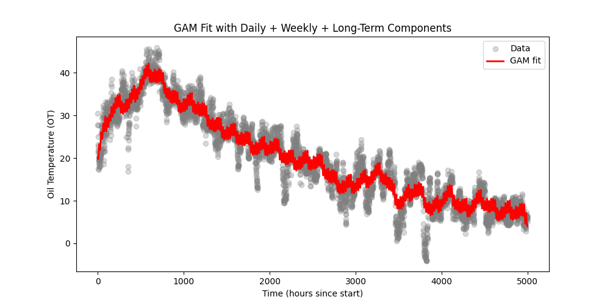
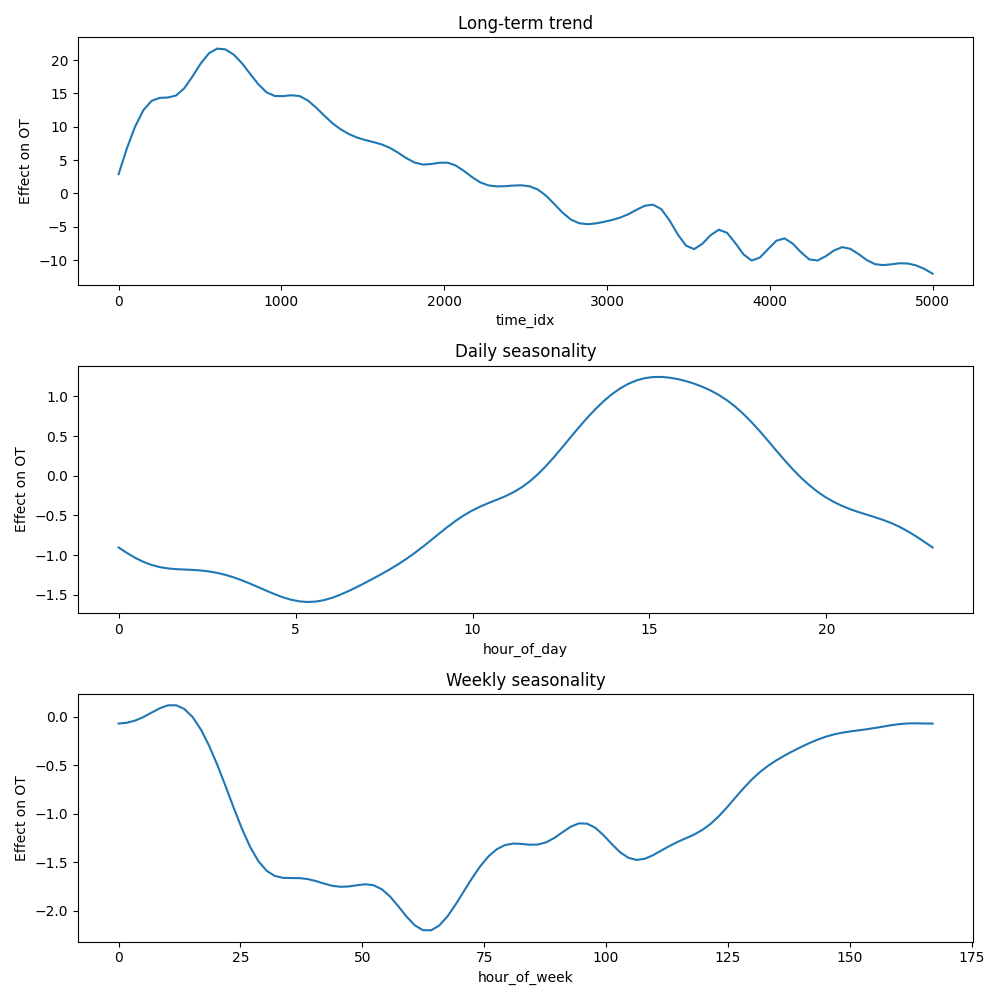

# How to run the file:

Run the command: `python3 gam.py`

After a few seconds, the plots should begin displaying, with the second plot appearing after the first one is closed.

# Plots produced by gam.py:

### GAM vs actual data:

In the first plot, you can see the line produced by the GAM in red, and the actual data points as gray dots. The x-axis describes the total time measured since the start, and the y-axis describes the Oil Temperature at the respective time since start.

As seen, there is a lot of "wiggliness" which I may choose to easily fix by incorporating a smoothing penalty in the GAM formula. Regardless, the plot demonstartes that the GAM does a successful job of fitting the data, which tells me the smooth functions that make up the GAM are properly defined.

---

### GAM vs actual data:

This seccond plot shows the smooth function trends, including the trend overall, the daily trend, and the weekly trend.

**_Long-term trend:_** You can see that it rises early on (positive values), peaks around time_idx ≈ 1000, then gradually declines toward the end.
This could represent seasonal drift, equipment aging, or a long-term environmental shift.

**_Daily seasonality:_** Around hour 5, the curve dips, showing that oil temperature tends to be lower in the early morning hours.
Around hour 15 (≈ 3 PM), the curve peaks, meaning oil temperature tends to be highest mid-afternoon. The curve then falls again toward night.

**_Weekly seasonality:_** The lowest points (around hour 50–100, i.e. days 2–4) suggest oil temperature is lower midweek.
Then it gradually rises toward the end of the week (hours 140–160, i.e. weekend).
This might reflect changes in industrial or transformer usage, maybe higher electrical loads or ambient temperatures on weekends.

